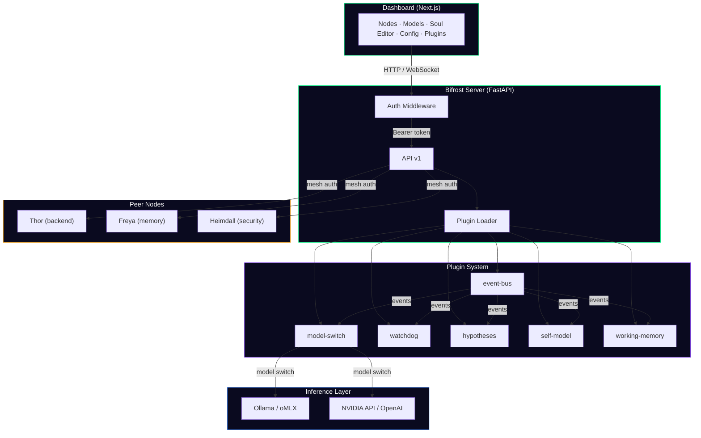
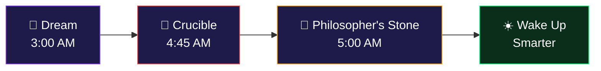

<div align="center">

# ⚡ Valhalla Mesh

### AI that runs on your hardware, learns from your work, and never forgets.

<!-- TODO: Replace with actual screenshot -->
<!--  -->
*[Screenshot: Dashboard showing a live node card with GPU stats, an agent mid-conversation, and real-time tool usage]*

</div>

---

**Stop teaching your AI the same things every session.** Valhalla deploys persistent agents on your own machines. They use your tools, remember what works, and get smarter every day — and nothing ever leaves your network.

### Why Valhalla?

🧠 **Agents that learn.** Procedural memory ranks what worked and what didn't. Dream cycles consolidate knowledge overnight. Day 1 it's generic. Day 90 it has instinct about your codebase.

🔒 **Your hardware, your data.** Runs on any GPU — RTX, Apple Silicon, cloud. No API keys required for local models. Zero data leaves your machine unless you want it to.

⚡ **Real work, not suggestions.** Agents read files, write code, run tests, make commits. Watch tool usage in real time on the dashboard. This isn't a chatbot — it's a coworker.

---

## Quick Start

```bash
# Install
brew install valhalla            # macOS
curl -fsSL https://get.valhalla.dev | bash  # Linux/WSL

# Initialize (auto-detects your GPU and model)
valhalla init

# Launch
valhalla start
# → Dashboard opens at localhost:3000
# → Start talking to your agent immediately
```

**Time to first conversation: under 2 minutes.**

<!-- TODO: Replace with actual screenshot -->
<!--  -->
*[Screenshot: Terminal showing `valhalla start` output with all green checkmarks, browser opening to Mission Control]*

---

## How It Works



**One node** is a local AI agent with tools, memory, and a personality. **Multiple nodes** form a mesh — specialized agents that collaborate, share learned knowledge, and develop a theory of mind about each other.

---

## What Makes This Different

| | ChatGPT / Claude | CrewAI / LangChain | **Valhalla** |
|---|---|---|---|
| Runs locally | ✗ | Partial | ✔ Any GPU |
| Remembers across sessions | ✗ | ✗ | ✔ Procedural memory |
| Learns from failures | ✗ | ✗ | ✔ Dream consolidation |
| Executes real work | ✗ | Partial | ✔ 23+ tools |
| Mesh of specialized agents | ✗ | Text-only multi-agent | ✔ Distributed cognition |
| Dashboard | Web UI | ✗ | ✔ Real-time, dark-mode |
| Immune system | ✗ | ✗ | ✔ Cross-node defense |
| Plugin ecosystem | ✗ | ✗ | ✔ Marketplace |

---

## The Overnight Learning Loop

While you sleep, your agents run a self-improvement cycle:



1. **Dream Consolidation** — compresses the day's experiences into generalizable knowledge
2. **The Crucible** — stress-tests every learned procedure ("what if the server is down?")
3. **Philosopher's Stone** — distills all knowledge into a wisdom prompt injected into every conversation

During the day, **somatic gating** gives agents gut feelings about bad actions, **procedural memory** ranks what worked, and **belief shadows** track what each peer knows.

For a task that needs quality iteration, agents use the **Pipeline** — cloud models write specs and check for regressions, local models iterate for free overnight, and lessons are distilled to memory after shipping.

→ [Full cognitive systems guide](docs/cognitive-overview.md) · [Pipeline UX](docs/pipeline-ux.md)

---

## Scale When You're Ready

Start with one machine. Add more when you need them.

```bash
# On a second machine:
valhalla join --mesh odin@192.168.1.10:8765
```

The node appears in your dashboard automatically. Assign it a role (backend, memory, security), pick a model, give it a personality — all from the UI. See the [Add-a-Node Guide](docs/add-a-node.md).

<!-- TODO: Replace with actual screenshot -->
<!--  -->
*[Screenshot: Dashboard Nodes page showing 3 connected nodes with different roles, green status indicators, and live GPU stats]*

---

## Extend With Plugins

Every capability is a plugin. Install from the marketplace or build your own.

```yaml
# plugin.yaml — that's the entire manifest
name: my-plugin
version: 1.0.0
description: What it does
routes:
  - method: POST
    path: /my-plugin/action
```

Browse and install plugins from the dashboard — one click, no restart. See the [Marketplace Spec](docs/marketplace.md).

---

## Docs

| | |
|---|---|
| [Quickstart](docs/quickstart.md) | Running in 5 minutes — real commands, real output |
| [Onboarding Guide](docs/onboarding.md) | The full new-user experience design |
| [Cognitive Systems](docs/cognitive-overview.md) | How agents dream, learn, and develop instinct |
| [Pipeline UX](docs/pipeline-ux.md) | Iterative quality loop — wizard, progress, escalation |
| [Personality Guide](docs/personality-guide.md) | How SOUL / IDENTITY / USER files work |
| [Plugin Dev Guide](docs/plugin-dev-guide.md) | Build a plugin from scratch |
| [Add-a-Node](docs/add-a-node.md) | Expand your mesh with one command |
| [Plugin Marketplace](docs/marketplace.md) | Publish and distribute plugins |
| [Architecture](ARCHITECTURE.md) | System design and sprint plan |
| [Security](SECURITY.md) | Trust model and auth |

---

## Requirements

| | Minimum | Recommended |
|---|---|---|
| **GPU** | 8 GB VRAM (RTX 3060) | 24+ GB VRAM (RTX 4090/5090) |
| **RAM** | 16 GB | 32+ GB |
| **Python** | 3.11+ | 3.12 |
| **OS** | macOS 14+ / Ubuntu 22+ / WSL2 | — |

Model-agnostic. When the next frontier model drops, Valhalla wraps around it and still adds the memory, learning, and immune system that the base model lacks.

---

<div align="center">

*Day 1, it follows instructions. Day 90, it has instinct.*

**[Get Started →](#quick-start)**

[OpenClaw](https://github.com/openclaw) · MIT License

</div>
