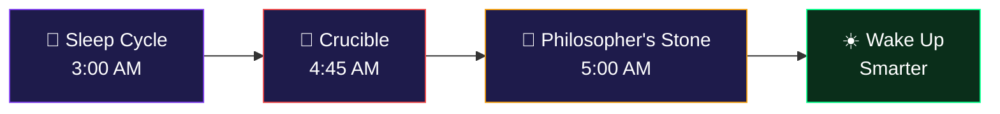
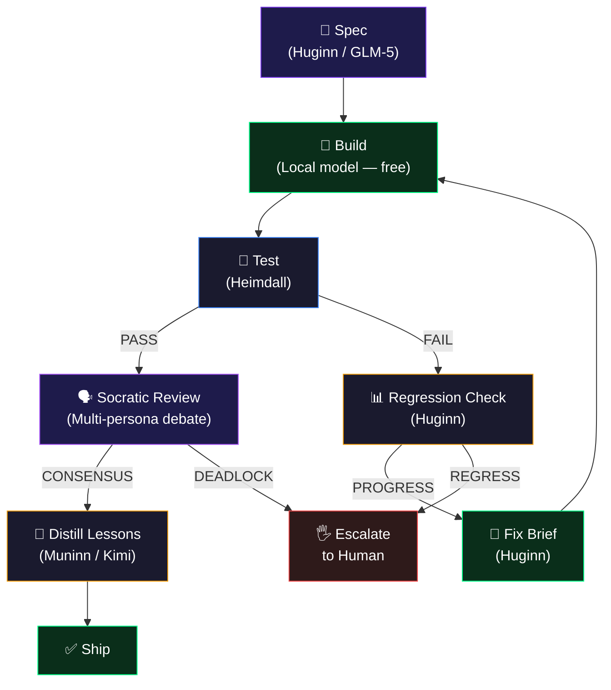

# Cognitive Systems — How Your Agents Think

> **For humans.** No jargon. No academic papers. Just what your agents actually do and why it matters.

---

## The One-Sentence Version

Your Valhalla agents sleep, dream, test their own knowledge, and wake up smarter every day — automatically.

---

## The Overnight Learning Loop

Every night, your agents run a self-improvement cycle. Here's what happens while you sleep:

### 1. 🌙 Dream Consolidation (3:00 AM)

**What it does:** Reviews everything the agent learned that day and compresses it into generalizable knowledge.

**How:** Takes all the day's experiences — code that worked, approaches that failed, feedback received — and finds patterns. Semantically similar experiences (30–70% similarity) get merged into principles. Below 30% is unrelated noise. Above 70% is near-duplicate.

**Why it matters:** Without this, your agent accumulates noise. With it, your agent builds wisdom. Day 1 it remembers "this specific function call failed." Day 90 it knows "this class of API calls tends to fail when rate-limited."

---

### 2. 🧪 The Crucible (4:45 AM)

**What it does:** Stress-tests the agent's own knowledge. Tries to break every procedure the agent has learned.

**How:** Takes each "I know how to do X" from procedural memory and asks: "What if the input is empty? What if the server is down? What if there's a race condition?" If the procedure breaks under pressure, it gets flagged for improvement.

**Why it matters:** Knowledge that survives the Crucible is reliable. Knowledge that doesn't gets fixed or downgraded. Your agent doesn't just store answers — it actively validates them.

**The result:**
- ✅ **Unbreakable** — procedure passed all stress tests. High confidence.
- ⚠️ **Stressed** — procedure works but has edge cases. Needs refinement.
- ❌ **Broken** — procedure fails under realistic conditions. Downgraded.

---

### 3. 💎 The Philosopher's Stone (5:00 AM)

**What it does:** Distills ALL accumulated knowledge — memories, crucible results, successful procedures, failed approaches — into a single "wisdom prompt" that's injected into every conversation.

**How:** Reads the agent's entire experience database and writes a compressed summary: "Here's what I know, what I'm good at, what I'm bad at, and what to watch out for." This prompt is rebuilt fresh every night from the latest data.

**Why it matters:** This is the difference between "an agent with a large database" and "an agent with judgment." The wisdom prompt gives the agent situational awareness before it even starts thinking about your request.

---

## The Daytime Systems

While the overnight loop builds foundational knowledge, these systems run during every interaction:

### 💓 Somatic Gating — Gut Feelings

**What it does:** Before high-risk actions, the agent checks its emotional memory. If past experiences with similar patterns were negative, it feels a "bad gut feeling" and blocks the action.

**Real example:** You ask the agent to deploy on a Friday afternoon. The last 3 Friday deploys caused incidents. The somatic system triggers a negative valence and the agent says "I'd recommend waiting until Monday — Friday deploys have historically caused issues for us."

**Why it matters:** This is System 1 thinking (fast, intuitive) filtering before System 2 thinking (slow, deliberate). The agent doesn't need to reason about why Friday deploys are bad — it just *feels* it. Sub-millisecond decision, not a 200ms RAG lookup.

---

### 🧠 Procedural Memory — What Worked

**What it does:** Every time the agent completes a task, the approach is recorded with a confidence score. Approaches that work frequently get ranked higher. Approaches that fail get deprioritized.

**The formula:** `confidence × log(1 + uses) × exp(-decay × age)`

In plain English: "How confident am I? How often has this worked? How recent is this knowledge?" Frequently-used, recent, successful approaches surface naturally. Old, rarely-used, or failed approaches fade.

---

### 🌐 Belief Shadows — Theory of Mind

**What it does:** Each agent tracks what it believes other agents know. "Thor already knows about the database schema, so I only need to tell him about the API change."

**Why it matters:** Without this, agents redundantly share information. With it, communication is efficient — like a team that's worked together for months and knows each other's context.

---

### 🛡️ Adaptive Immunity — Learning from Attacks

**What it does:** When any node detects an adversarial prompt (prompt injection, jailbreak attempt), the attack signature is broadcast to all other nodes within 60 seconds. Every node updates its deny-list. No human intervention needed.

**Why it matters:** Each attack makes the entire mesh stronger. Traditional security patches take days. Valhalla's immune system takes seconds.

---

## The Pipeline — Iterative Quality Loop

When an agent needs to build something substantial, it uses the Pipeline:

**The key insight:** Local models are weaker than cloud models — but they're free. Let a local model iterate 20 times overnight. Use expensive cloud models only for the parts that need real intelligence: writing specs, checking for regression, and reviewing quality.

**After the pipeline ships:** Muninn distills the lessons learned — "JWT refresh needs a mutex," "always test login after auth changes" — and stores them in procedural memory. The next pipeline starts smarter.

---

## Why This Matters

Every AI product on the market gives you a brilliant expert with amnesia. The context window resets. The knowledge vanishes. Tomorrow you start from zero.

Valhalla agents accumulate operational intelligence:

| Timeframe | What Your Agent Knows |
|---|---|
| **Day 1** | Nothing. Follows instructions literally. |
| **Week 1** | Knows your codebase structure. Remembers which tests are flaky. |
| **Month 1** | Has gut feelings about bad patterns. Preemptively checks for your recurring bugs. |
| **Month 3** | Knows which deployment patterns fail, which approaches work for your team's style, which edge cases matter for your domain. |

Even if someone copies every line of Valhalla's code, they start at Day 1. Your 90 days of accumulated knowledge is the moat — and it deepens every day the system runs.
